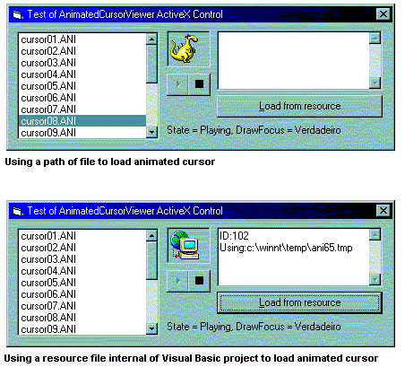

<div align="center">

## AnimatedCursorViewer \- Activex Control


</div>

### Description

This control show Animated Cursor Files (*.ani) into a window. Count with more actions (play,pause,drawfocus,etc) and play animations files stored in Resource Files of Visual Basic Project.
 
### More Info
 


<span>             |<span>
---                |---
**Submitted On**   |2003-09-24 10:42:40
**By**             |[Mauricio Cunha](https://github.com/Planet-Source-Code/PSCIndex/blob/master/ByAuthor/mauricio-cunha.md)
**Level**          |Intermediate
**User Rating**    |4.8 (19 globes from 4 users)
**Compatibility**  |VB 5\.0, VB 6\.0, VBA MS Excel
**Category**       |[OLE/ COM/ DCOM/ Active\-X](https://github.com/Planet-Source-Code/PSCIndex/blob/master/ByCategory/ole-com-dcom-active-x__1-29.md)
**World**          |[Visual Basic](https://github.com/Planet-Source-Code/PSCIndex/blob/master/ByWorld/visual-basic.md)
**Archive File**   |[AnimatedCu1649879252003\.zip](https://github.com/Planet-Source-Code/mauricio-cunha-animatedcursorviewer-activex-control__1-48769/archive/master.zip)

### API Declarations

```
Private Declare Function SendMessage Lib "user32" Alias "SendMessageA" (ByVal hwnd As Long, ByVal wMsg As Long, ByVal wParam As Long, lParam As Any) As Long
Private Declare Function LoadCursorFromFile Lib "user32" Alias "LoadCursorFromFileA" (ByVal lpFileName As Any) As Long
Private Declare Function SetWindowPos Lib "user32" (ByVal hwnd As Long, ByVal hWndInsertAfter As Long, ByVal X As Long, ByVal Y As Long, ByVal cx As Long, ByVal cy As Long, ByVal wFlags As Long) As Long
Private Declare Function CreateWindowEx Lib "user32" Alias "CreateWindowExA" (ByVal dwExStyle As Long, ByVal lpClassName As String, ByVal lpWindowName As String, ByVal dwStyle As Long, ByVal X As Long, ByVal Y As Long, ByVal nWidth As Long, ByVal nHeight As Long, ByVal hwndParent As Long, ByVal hMenu As Long, ByVal hInstance As Long, lpParam As Any) As Long
Private Declare Function DestroyWindow Lib "user32" (ByVal hwnd As Long) As Long
Private Declare Function DestroyCursor Lib "user32" (ByVal hCursor As Long) As Boolean
Private Declare Function IsWindow Lib "user32" (ByVal hwnd As Long) As Long
Private Declare Function OSGetTempPath Lib "kernel32" Alias "GetTempPathA" (ByVal BufferLength As Long, ByVal Result As String) As Long
Private Declare Function OSGetTempFilename Lib "kernel32" Alias "GetTempFileNameA" (ByVal FilePath As String, ByVal Prefix As String, ByVal wUnique As Long, ByVal TempFileName As String) As Long
Private Declare Function DrawFocusRect Lib "user32" (ByVal hdc As Long, lpRect As RECT) As Long
```


